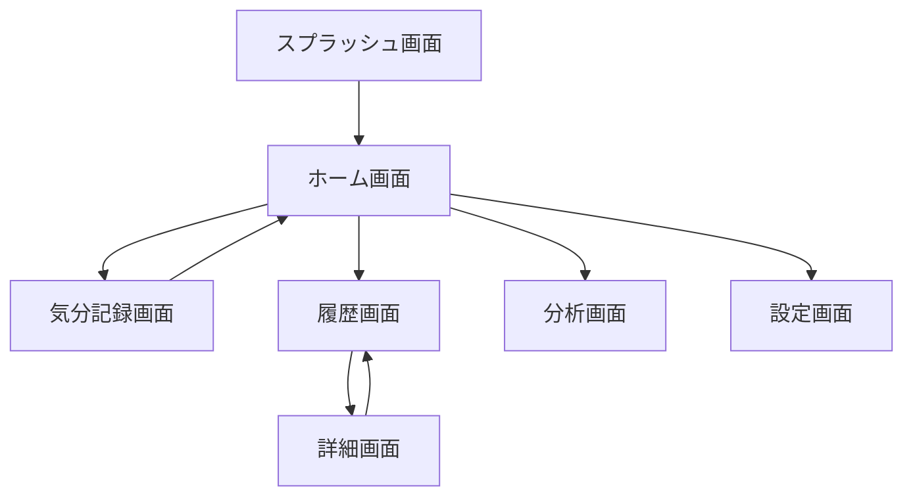

# 気分記録アプリ設計書

## 1. アーキテクチャ概要

### 1.1 採用アーキテクチャ
- **クリーンアーキテクチャ** + **BLoCパターン**
- レイヤー構成：
  - Presentation層（UI/BLoC）
  - Domain層（ビジネスロジック）
  - Data層（データソース/リポジトリ）

### 1.2 技術スタック
- **フレームワーク**: Flutter 3.x
- **状態管理**: flutter_bloc
- **ローカルDB**: sqflite
- **依存性注入**: get_it
- **ルーティング**: go_router
- **日付処理**: intl
- **グラフ**: fl_chart
- **画像**: image_picker

## 2. ディレクトリ構造

```
lib/
├── core/
│   ├── constants/
│   │   ├── colors.dart
│   │   └── strings.dart
│   ├── errors/
│   │   └── failures.dart
│   ├── utils/
│   │   ├── date_formatter.dart
│   │   └── validators.dart
│   └── theme/
│       └── app_theme.dart
├── features/
│   ├── mood/
│   │   ├── data/
│   │   │   ├── datasources/
│   │   │   │   └── mood_local_datasource.dart
│   │   │   ├── models/
│   │   │   │   └── mood_entry_model.dart
│   │   │   └── repositories/
│   │   │       └── mood_repository_impl.dart
│   │   ├── domain/
│   │   │   ├── entities/
│   │   │   │   └── mood_entry.dart
│   │   │   ├── repositories/
│   │   │   │   └── mood_repository.dart
│   │   │   └── usecases/
│   │   │       ├── add_mood_entry.dart
│   │   │       ├── get_mood_entries.dart
│   │   │       └── get_mood_statistics.dart
│   │   └── presentation/
│   │       ├── bloc/
│   │       │   ├── mood_bloc.dart
│   │       │   ├── mood_event.dart
│   │       │   └── mood_state.dart
│   │       ├── pages/
│   │       │   ├── home_page.dart
│   │       │   ├── add_mood_page.dart
│   │       │   └── history_page.dart
│   │       └── widgets/
│   │           ├── mood_card.dart
│   │           ├── mood_calendar.dart
│   │           └── mood_chart.dart
│   ├── auth/
│   │   └── ... (認証関連)
│   └── settings/
│       └── ... (設定関連)
├── injection_container.dart
└── main.dart
```

## 3. データベース設計

### 3.1 テーブル構造

#### mood_entries テーブル
```sql
CREATE TABLE mood_entries (
  id TEXT PRIMARY KEY,
  user_id TEXT NOT NULL,
  mood_level INTEGER NOT NULL CHECK (mood_level >= 1 AND mood_level <= 5),
  date TEXT NOT NULL,
  memo TEXT,
  photo_path TEXT,
  created_at TEXT NOT NULL,
  updated_at TEXT NOT NULL
);
```

#### tags テーブル
```sql
CREATE TABLE tags (
  id TEXT PRIMARY KEY,
  name TEXT NOT NULL,
  color TEXT NOT NULL,
  icon TEXT
);
```

#### mood_entry_tags テーブル（中間テーブル）
```sql
CREATE TABLE mood_entry_tags (
  mood_entry_id TEXT NOT NULL,
  tag_id TEXT NOT NULL,
  PRIMARY KEY (mood_entry_id, tag_id),
  FOREIGN KEY (mood_entry_id) REFERENCES mood_entries(id),
  FOREIGN KEY (tag_id) REFERENCES tags(id)
);
```

## 4. 主要クラス設計

### 4.1 Entity

```dart
class MoodEntry {
  final String id;
  final String userId;
  final int moodLevel;
  final DateTime date;
  final String? memo;
  final List<Tag> tags;
  final String? photoPath;
  final DateTime createdAt;
  final DateTime updatedAt;
}

class Tag {
  final String id;
  final String name;
  final Color color;
  final IconData? icon;
}
```

### 4.2 Repository Interface

```dart
abstract class MoodRepository {
  Future<Either<Failure, MoodEntry>> addMoodEntry(MoodEntry entry);
  Future<Either<Failure, List<MoodEntry>>> getMoodEntries({
    DateTime? startDate,
    DateTime? endDate,
    List<String>? tagIds,
  });
  Future<Either<Failure, MoodEntry>> updateMoodEntry(MoodEntry entry);
  Future<Either<Failure, void>> deleteMoodEntry(String id);
  Future<Either<Failure, MoodStatistics>> getMoodStatistics({
    DateTime? startDate,
    DateTime? endDate,
  });
}
```

### 4.3 BLoC設計

```dart
// Events
abstract class MoodEvent {}
class AddMoodEntry extends MoodEvent {
  final MoodEntry entry;
}
class LoadMoodEntries extends MoodEvent {
  final DateTime? startDate;
  final DateTime? endDate;
}

// States
abstract class MoodState {}
class MoodInitial extends MoodState {}
class MoodLoading extends MoodState {}
class MoodLoaded extends MoodState {
  final List<MoodEntry> entries;
}
class MoodError extends MoodState {
  final String message;
}
```

## 5. 画面遷移設計



## 6. UI/UXデザイン原則

### 6.1 カラースキーム
- 気分レベル1: #E57373（赤）
- 気分レベル2: #FFB74D（オレンジ）
- 気分レベル3: #FFF176（黄）
- 気分レベル4: #AED581（黄緑）
- 気分レベル5: #81C784（緑）

### 6.2 フォント
- 見出し: Noto Sans JP Bold
- 本文: Noto Sans JP Regular
- 数値: Roboto

### 6.3 アニメーション
- ページ遷移: スライドアニメーション
- 気分選択: スケールアニメーション
- グラフ表示: フェードイン

## 7. セキュリティ設計

### 7.1 データ保護
- SQLCipher によるデータベース暗号化
- SharedPreferences の暗号化（flutter_secure_storage）

### 7.2 認証
- ローカル認証：local_auth パッケージ
- PIN コード：4-6桁の数字
- 生体認証：指紋/Face ID

## 8. パフォーマンス最適化

### 8.1 データ読み込み
- ページネーション（30件ずつ）
- キャッシュ戦略（最新100件をメモリキャッシュ）

### 8.2 画像処理
- 画像圧縮（最大1MB）
- サムネイル生成（リスト表示用）

## 9. エラーハンドリング

### 9.1 エラー種別
- NetworkFailure: ネットワーク関連
- DatabaseFailure: データベース関連
- ValidationFailure: 入力検証関連

### 9.2 ユーザーフィードバック
- SnackBar: 一時的なメッセージ
- Dialog: 重要なエラー
- EmptyState: データなし状態

## 10. テスト戦略

### 10.1 単体テスト
- Use Cases: 100%カバレッジ
- Repositories: モック使用
- BLoCs: 状態遷移テスト

### 10.2 ウィジェットテスト
- 各画面の基本動作
- カスタムウィジェット

### 10.3 統合テスト
- 主要なユーザーフロー
- データ永続化の確認